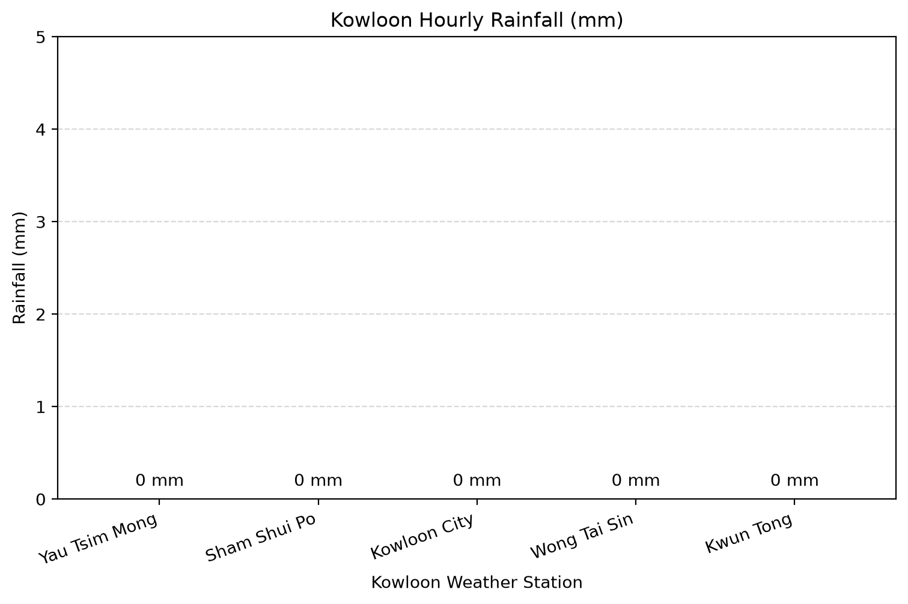

# Kowloon Hourly Rainfall Data Visualization

This repository is built for Assignment 2 of the Programming for Art and Design course. It collects, stores, and visualizes real-time weather observation metrics for districts across Kowloon, Hong Kong.

## Phenomenon and Data Source

- **Phenomenon**: Hourly rainfall and localized meteorological observations in the Kowloon region of Hong Kong.
- **Data Source**: Official open-data API feed provided by the [Hong Kong Observatory (HKO)](https://data.weather.gov.hk/weatherAPI/opendata/weather.php?dataType=rhrread&lang=en).

The data is fetched as a raw JSON format via the official HKO endpoint. In accordance with the course guidelines, the raw data file is saved locally in the `data/` directory upon the first request to avoid repeated network calls and ensure offline reproducibility.

## Generated Visualization

Below is the latest generated bar chart displaying the rainfall measurements across key weather stations in Kowloon:



The visualization reads the cached raw JSON dataset, extracts localized station metrics, filters out relevant Kowloon districts (such as Kowloon City, Wong Tai Sin, Kwun Tong, Sham Shui Po, and Yau Tsim Mong), and outputs a cleaned bar chart saved to `out/plot.png`.

## How to Run the Project

1. **Fetch Raw Data**:
   Download the latest raw JSON response from the HKO API:
   ```bash
   uv run fetch.py